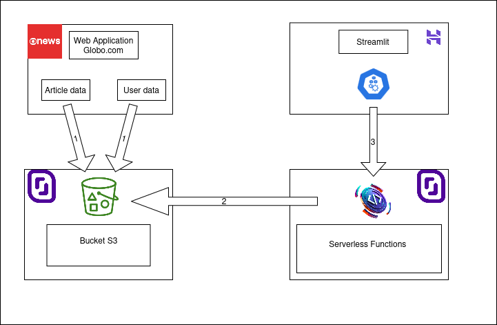
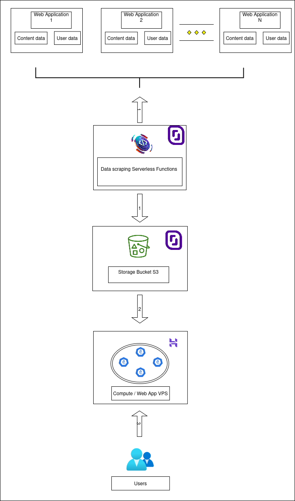

#  MVP de recommandation d’articles

Ce dépôt contient le code et les outils pour le **premier MVP** d'une application de recommandation d'articles.

---

## 📌 Contexte

Dans cette première version de l’application :

- L’utilisateur reçoit une **sélection de cinq articles** recommandés.
- Je n'ai pas encore de données réelles utilisateurs ; j'utilise donc les données publiques **https://www.kaggle.com/datasets/gspmoreira/news-portal-user-interactions-by-globocom#clicks_sample.csv¶** pour développer et tester le système de recommandation.
- Le MVP se concentre sur la **fonctionnalité critique** : proposer une recommandation de 5 articles pour un utilisateur donné rapidement.
- L’architecture doit être pensée pour intégrer facilement **de nouveaux utilisateurs et de nouveaux articles** à l’avenir.

---

## 📂 Structure complète du dépôt


```
Projet10/
├── notebooks/
│   └── Projet10-Data-Analysis.ipynb
├── S3_storage/
│   ├── README
│   └── copy_files_to_S3_Scaleway.bash
├── functions/
│   ├── README
│   ├── deploy_functions.bash
│   └── zips/
│       ├── function_compute_offline_cache.zip
│       └── function_compute_online_cache.zip
└── docker/
    ├── docker-compose.yml
    ├── streamlit/
    │   ├── Dockerfile
    │   ├── app.py
    │   └── requirements.txt
    └── traefik/
        ├── Dockerfile
        ├── dynamic_conf.yml
        ├── letsencrypt/
        │   └── acme.json
        └── traefik.yml


- Le répertoire notebook contient le notebook d'analyse et de traitement des données ainsi que de conception et test des outils utilisés.
- Le répertoire S3_storage contient le nécessaire pour l'automatisation de l'export des données sur un bucket S3
- Le répertoire functions contient le nécessaire pour l'automatisation du déploiement des Serverless functions Scaleway utilisées.
- Le répertoire docker contient le nécessaire pour créer les container docker utilisés pour créer une application de démonstration du système de recommandation d'articles.

```

---

## ⚙️ Fonctionnalités principales

- **Calcul des recommandations**
  - Offline : pré-calcul des articles les plus proches de chaque articles en utilisant les embeddings.
  - Online : calcul à la demande pour un utilisateur donné.
- **Interface utilisateur**
  - Affichage des **5 articles recommandés** pour l’utilisateur sélectionné.
- **Stockage et gestion des données**
  - Upload automatisé sur un bucket S3 via un script aws cli.
- **Déploiement des fonctions**
  - Déploiement automatisé via un script scw cli.
- **Déploiement de l'applicatif de test**
  - Le code nécessaire pour créer les containers nécessaire est déposé dans le dossier docker
  - Ces dockers peuvent ensuite être déposé sur un docker repository et déployé sur tout système supportant docker

---

## 🏛️ Architecture actuelle



1. **Les données applicatives** sur les articles et les utilisateurs sont traitées (voir notebook) puis déposées (voir répertoire `S3_Storage`) sur un **bucket S3 Scaleway**.

2. **Deux Serverless functions** sont déployées sur Scaleway :  

   - **Fonction compute "live"** :
     - Prend en entrée un `user_id`
     - Charge les données brutes des articles et des utilisateurs
     - Trouve les articles consultés par l'utilisateur
     - Identifie l'article le plus récent et le plus ancien consulté par l'utilisateur
     - Calcule l'embedding de l'article moyen (vecteur moyen)
     - Trouve les 5 articles les plus proches (en utilisant les distances **cosine** et **euclidienne**) de :  
       - l'article le plus récent consulté par l'utilisateur
       - l'article le plus ancien consulté par l'utilisateur
       - l'article moyen

   - **Fonction compute "offline"** :
     - Prend en entrée un `user_id`
     - Charge les données brutes des articles, des utilisateurs **et un fichier CSV contenant pour chaque article les 5 articles les plus proches** (distance euclidienne calculée à partir des embeddings de la fonction "live")
     - Trouve les articles consultés par l'utilisateur
     - Identifie l'article le plus récent et le plus ancien consulté par l'utilisateur
     - Calcule l'embedding de l'article moyen (vecteur moyen)
     - Utilise le CSV pour obtenir les 5 articles les plus proches de l'article le plus récent et du plus ancien consulté
     - Calcule les 5 articles les plus proches de l'article moyen

3. **Application Streamlit de démonstration** (déployée sur un VPS Hostinger) :
   - Prend en entrée un `user_id`
   - Propose un **mode de calcul live** et un **mode de calcul offline**, en faisant appel séparément aux deux fonctions ci-dessus
   - Fournit une **recommandation de 5 articles** :
     - Les 2 articles les plus proches de l'article le plus récent consulté par l'utilisateur
     - Les 2 articles les plus proches de l'article moyen
     - L'article le plus proche de l'article le plus ancien consulté par l'utilisateur


---

---

## 📈 Architecture cible




1. **Prise en compte de nouveaux utilisateurs et nouveaux articles** :

   - Ajout de fonctions pour scrapper les données de contenu et de comportement utilisateur sur les différentes applications web cibles pour la recommandation de contenu, en se positionnant astucieusement pour avoir la meilleure connexion réseau
   - Ces fonctions déposeront les données brutes sur un **bucket S3**
   - **L'utilisation de fonctions permet d'avoir une capacité de scrapping extensible et facilement déplaçable géographiquement**
   - **L'utilisation d'un bucket S3 permet un stockage extensible et sécurisé**

2. **Sur VPS avec des ressources de traitement suffisantes** :

   - Ajout d'une tâche planifiée pour lancer la fonction de scrapping
   - Ajout d'une tâche planifiée pour calculer les embeddings des articles courants
   - Ajout d'une tâche planifiée pour calculer les 5 articles les plus proches de chaque article
   - Ajout d'un container reverse proxy pour intercepter, distribuer et sécuriser les accès utilisateurs
   - Ajout d'un container Redis pour exposer efficacement les données traitées à l'application de recommandation
   - Ajout d'un container Streamlit pour proposer une interface web interactive
   - Ajout d'un container FastAPI pour proposer un accès en CLI permettant aux utilisateurs d'automatiser les requêtes
   - L'application formulera les recommandations en utilisant au maximum la matrice des distances précalculées par souci de rapidité et d'efficacité

3. **Accès utilisateur** :

   - Les utilisateurs pourront avoir accès à une version web et CLI de l'application de recommandation d'articles
   - Un mapping `user_id` / identité pour les différentes sources d'article devra être étudié


---

## 💡 Remarques

- Les fichiers volumineux issus de https://www.kaggle.com/datasets/gspmoreira/news-portal-user-interactions-by-globocom#clicks_sample.csv utilisés dans le notebook n'ont pas été déposé sur ce répertoire github car trop volumineux.
- Pour tester le notebook, téléchargez les données dans le même répertoire que le notebook si besoin.

